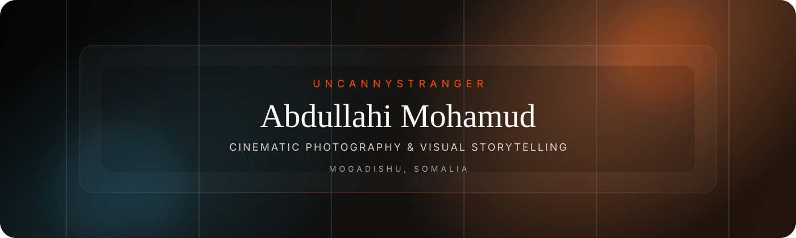
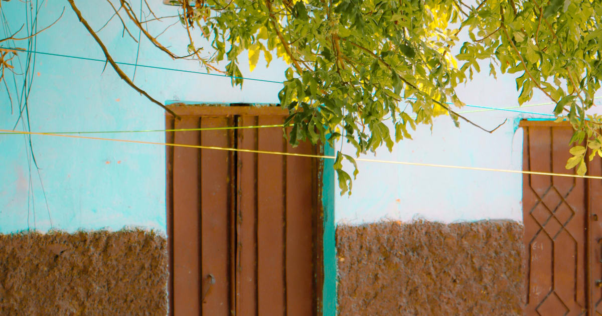
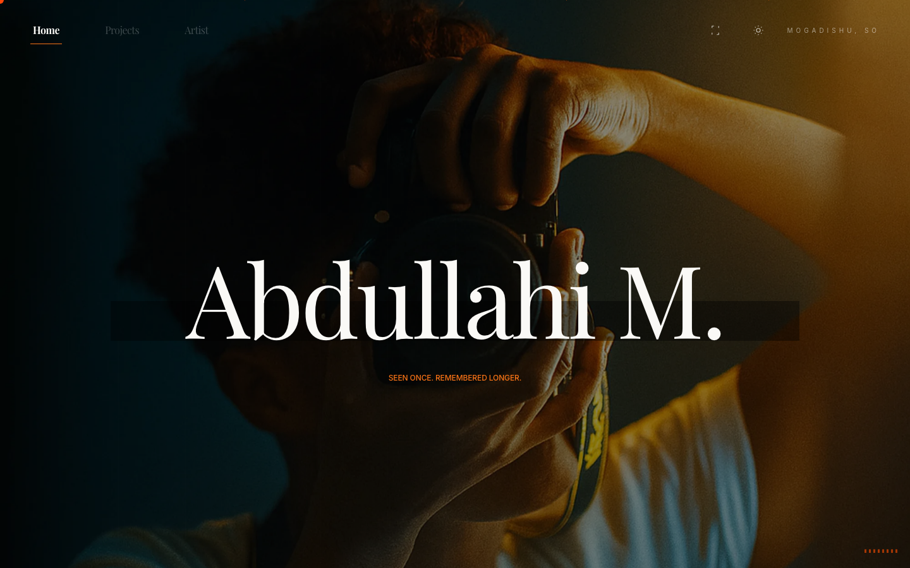
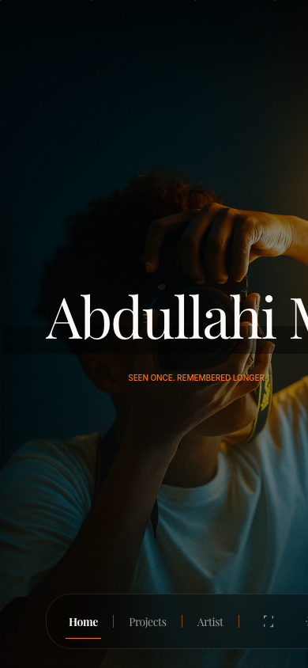

  

   

  

    <strong>Abdullahi Mohamud</strong> 
    <em>uncannystranger</em> 
    Somali Photographer · Digital Artist · Creative Technologist 
    Mogadishu, Somalia
  

  

    
    
    
  

---

## About

I am **Abdullahi Mohamud**, professionally known as **uncannystranger** — a multidisciplinary creative working at the intersection of **visual storytelling, technology, and digital identity**.

My work focuses on **cinematic photography**, human-centered narratives, and building modern digital platforms that elevate how Somali stories are seen, archived, and discovered globally.

## Website Preview

  

 

<table>
  <tr>
    <td width="72%" valign="top">
      
    </td>
    <td width="28%" valign="top">
      
    </td>
  </tr>
</table>

## What I Do

<table>
  <tr>
    <th align="left">Photography &amp; Visual Storytelling</th>
    <th align="left">Technology &amp; Digital Media</th>
    <th align="left">Design &amp; Editing</th>
  </tr>
  <tr>
    <td valign="top">
      Cinematic portraits 
      Documentary and street photography 
      Landscape and nature visuals 
      Emotion-driven compositions 
      Somali visual narratives
    </td>
    <td valign="top">
      Modern web development 
      Frontend experiences 
      SEO and structured data 
      Digital identity systems 
      Performance-focused design
    </td>
    <td valign="top">
      Photo retouching 
      Cinematic color grading 
      Visual design 
      Layout systems 
      Brand aesthetics
    </td>
  </tr>
</table>

## The Website

This repository powers the official website of **Uncanny Stranger** — a cinematic photography portfolio and creative identity platform built to present original work with an editorial rhythm, premium visual treatment, and strong public discoverability.

The site combines:

- cinematic photography and exhibition-led storytelling
- editorial-style composition, serif typography, and glass-like interface details
- structured data, metadata, and sitemap support for search visibility
- responsive layouts across desktop and mobile
- performance-focused image delivery through transformed Cloudinary assets
- a modern React/Vite architecture deployed for a polished public portfolio experience

## Tech Stack

  
  
  
  
  
  
  
  

## Featured Work / Highlights

- Cinematic photography rooted in atmosphere, stillness, and memory
- Editorial visuals with a restrained, premium presentation style
- Documentary-led storytelling connected to Somali identity and place
- A web-based portfolio system designed for discoverability, performance, and long-term public presence
- A creative practice spanning image-making, digital media, and personal brand architecture

## Professional Experience

| Role | Organization / Recognition | Period |
| --- | --- | --- |
| Freelance Photographer | Featured in *Quadro Magazine* | 2025 |
| Digital Marketing Manager &amp; Editor | Momento Studio | 2022–2024 |
| Software Developer &amp; Web / Graphic Designer | Huud Technology | 2023–2024 |
| Graphic Design Competition Winner | Independent recognition | 2021 |

## Skills

| Creative | Technical | Brand / Strategy |
| --- | --- | --- |
| Photography | HTML | Digital marketing |
| Cinematic editing | CSS | Content strategy |
| Adobe Photoshop | JavaScript | Creative direction |
| Adobe Lightroom | Python | Online identity |
| Visual design | C# · C++ | Search visibility |
| Color grading | SQL · PHP | Performance optimization |
|  | SEO · structured data |  |

## Online Presence

  
  
  
  
  

## Vision

My long-term goal is to build a globally recognized Somali creative identity, contribute to cultural preservation through visuals, and create work that lasts beyond trends.

I believe storytelling — when done with honesty and intention — can reshape perception, history, and opportunity.

> “Move slowly. Observe deeply. Build deliberately.”

---

  © Abdullahi Mohamud · uncannystranger

